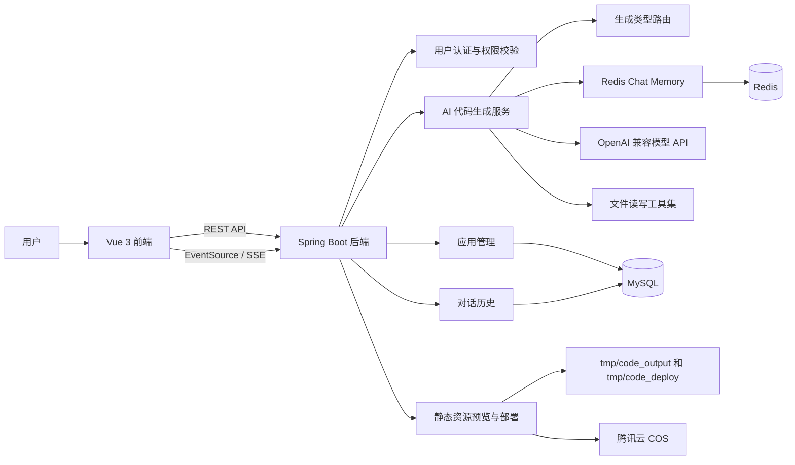

# Code Generate

简体中文 | English

Java 21 · Spring Boot 3.5 · Vue 3.5 · TypeScript · MySQL · Redis · LangChain4j · LangGraph4j · Tencent COS

AI 应用生成平台：一句话创建网站应用，并支持对话式迭代、实时预览、在线部署、代码下载与后台管理。

让创意从一句 Prompt 变成可访问的网站作品。

[核心亮点](#-核心亮点) · [系统架构](#-系统架构) · [功能模块](#-功能模块) · [技术栈](#-技术栈) · [快速开始](#-快速开始) · [API-概览](#-api-概览) · [项目结构](#-项目结构)

## ✨ 为什么选择 Code Generate？

Code Generate 不是简单地把大模型返回内容展示出来，而是围绕“生成一个真实可运行的网站应用”构建了完整链路：

| 痛点 | Code Generate 的解决方案 |
| --- | --- |
| 生成结果难落地 | 将 AI 输出解析为 HTML、多文件项目或 Vue 工程，并保存为真实文件目录 |
| 生成过程不透明 | 通过 SSE 流式返回模型内容、工具调用请求和工具执行结果 |
| 无法持续迭代 | 按应用维度保存对话历史，并接入 Redis 会话记忆 |
| 作品难预览和交付 | 自动提供静态资源预览、部署访问地址和源码 ZIP 下载 |
| 管理成本高 | 提供应用、用户、对话历史的后台管理能力 |

## 🔥 核心亮点

### 🎯 三种代码生成模式

平台会根据用户初始需求，通过 AI 路由服务自动选择生成类型：

```text
用户 Prompt
    ↓
AI 生成类型路由
    ↓
HTML 单文件 / 原生多文件 / Vue 工程
    ↓
流式生成 → 解析 → 保存 → 预览 → 部署
```

- **HTML 单文件模式**：适合轻量页面、活动页、落地页。
- **原生多文件模式**：生成 `index.html`、`style.css`、`script.js` 等结构化文件。
- **Vue 工程模式**：通过工具调用写入完整 Vue 项目，并在部署前执行构建。

### 🤖 对话式 AI 代码生成

后端基于 LangChain4j 构建 AI 服务实例：

- 按 `appId + codeGenType` 缓存 AI 服务，隔离不同应用上下文。
- 使用 Redis Chat Memory 保存应用级会话记忆。
- HTML / 多文件模式使用流式模型直接生成代码。
- Vue 工程模式使用工具调用完成文件读写、目录读取、文件修改和删除。
- 输入护栏拦截不安全 Prompt，降低异常生成风险。

### ⚡ SSE 实时生成与预览

前端在应用对话页通过 EventSource 连接后端 SSE 接口，模型响应会实时展示在聊天窗口中。生成完成后，后端将文件保存到 `tmp/code_output`，前端通过静态资源接口加载生成结果。

```text
用户消息 → /api/app/chat/gen/code
    ↓
SSE 流式响应
    ↓
聊天窗口实时展示
    ↓
生成文件保存到 tmp/code_output
    ↓
iframe 实时预览生成页面
```

### 🧩 可视化元素选择

前端内置 iframe 可视化编辑辅助能力：

- 进入编辑模式后，可在生成页面中选择目标元素。
- 自动提取标签、选择器、文本内容和页面路径。
- 将元素上下文拼接到下一轮 Prompt，方便精确修改局部样式或内容。

### 🚀 部署、截图与下载

- 部署时将生成物复制到 `tmp/code_deploy/{deployKey}`。
- Vue 工程部署前自动执行构建，并部署 `dist` 目录。
- 部署完成后返回可访问 URL。
- 异步使用 Selenium 截图，并上传到腾讯云 COS 作为应用封面。
- 应用创建者可下载生成源码 ZIP。

### 🛡️ 权限、限流与监控

- Session + Redis 保存登录态。
- 用户角色分为普通用户和管理员。
- 普通用户只能操作自己的应用，管理员可管理用户、应用和对话历史。
- Redisson 分布式限流保护 AI 生成接口。
- Actuator + Micrometer + Prometheus 暴露健康检查和 AI 调用指标。

## 🏗️ 系统架构



## 📦 功能模块

### 🔐 用户认证与权限

- 用户注册、登录、注销、获取当前登录用户。
- 用户个人资料更新。
- 管理员新增、编辑、删除、分页查询用户。
- 基于 `@AuthCheck` 注解进行角色权限拦截。

### 🧠 AI 应用生成

- 创建应用时保存初始 Prompt，并自动判断代码生成类型。
- 支持 HTML、原生多文件、Vue 工程三类生成模式。
- 支持多轮对话持续修改同一个应用。
- 支持游标分页加载历史对话。
- 支持 AI 消息 Markdown 渲染和代码高亮。

### 🖥️ 作品预览与编辑辅助

- 右侧 iframe 实时展示生成页面。
- 支持新窗口打开预览结果。
- 支持可视化选择页面元素，并基于元素上下文继续对话修改。
- 支持查看应用详情、编辑应用名称、删除应用。

### 🚀 应用部署与交付

- 一键部署生成作品。
- 自动生成 `deployKey` 和部署访问地址。
- Vue 工程自动构建后部署。
- 支持源码 ZIP 下载。
- 支持异步截图并上传封面。

### 🛠️ 管理后台

- 应用管理：查询、编辑、删除、设置精选。
- 用户管理：查询、新增、编辑、删除。
- 对话管理：管理员分页查询全站对话历史。
- 精选应用会展示在首页案例区，并使用缓存提升查询性能。

### 🔬 LangGraph4j 工作流实验

项目包含 LangGraph4j 代码生成工作流示例：

- 图片资源规划与收集。
- Prompt 增强。
- 生成类型路由。
- 代码生成。
- 代码质量检查。
- Vue 工程构建。
- 支持串行工作流、并发图片收集工作流和子图工作流。

## 🛠️ 技术栈

### 后端核心

| 层次 | 技术 | 版本 | 说明 |
| --- | --- | --- | --- |
| 语言 | Java | 21 | 虚拟线程、现代 Java 语法 |
| 框架 | Spring Boot | 3.5.11 | Web、AOP、Actuator、Cache |
| ORM | MyBatis-Flex | 1.11.6 | 实体映射、分页查询、代码生成 |
| 数据库 | MySQL | 8.x 推荐 | 用户、应用、对话历史 |
| 缓存 / 会话 | Redis + Spring Session | - | 登录态、AI 对话记忆 |
| 分布式限流 | Redisson | 3.50.0 | 用户级、接口级、IP 级限流 |
| AI 编排 | LangChain4j | 1.1.0 / 1.1.0-beta7 | AI Service、流式模型、工具调用、Memory |
| 工作流 | LangGraph4j | 1.6.0-rc2 | 代码生成工作流实验 |
| 对象存储 | 腾讯云 COS SDK | 5.6.227 | 截图封面上传 |
| 网页截图 | Selenium + WebDriverManager | 4.33.0 / 6.1.0 | 部署后自动截图 |
| API 文档 | Knife4j + SpringDoc | 4.4.0 | `/api/doc.html` |
| 监控 | Micrometer + Prometheus | - | AI 请求、耗时、Token 指标 |

### 前端核心

| 层次 | 技术 | 版本 | 说明 |
| --- | --- | --- | --- |
| 语言 | TypeScript | 5.8 | 类型约束 |
| 框架 | Vue 3 | 3.5.17 | Composition API |
| 构建 | Vite | 7.0 | 前端开发与构建 |
| UI 组件 | Ant Design Vue | 4.2.6 | 页面组件与后台表格 |
| 路由 | Vue Router | 4.5.1 | 页面路由 |
| 状态管理 | Pinia | 3.0.3 | 登录用户状态 |
| HTTP 客户端 | Axios | 1.11.0 | API 请求 |
| Markdown | markdown-it + highlight.js | 14.1 / 11.11 | AI 回复渲染 |
| 接口生成 | @umijs/openapi | 1.13.15 | 根据 OpenAPI 生成 TS API |

### 基础设施

| 组件 | 用途 |
| --- | --- |
| MySQL | 主业务数据库 |
| Redis | Session、AI Chat Memory、限流辅助 |
| OpenAI 兼容模型 API | Chat、Streaming Chat、Routing Chat |
| 腾讯云 COS | 应用封面截图存储 |
| Prometheus | 采集 Spring Boot 指标 |

## 🚀 快速开始

### 环境要求

| 组件 | 版本要求 | 说明 |
| --- | --- | --- |
| JDK | 21 | 后端运行环境 |
| Maven | 3.9+ 推荐 | 也可使用项目内 `./mvnw` |
| Node.js | 20+ 推荐 | 前端开发环境 |
| MySQL | 8.x 推荐 | 业务数据库 |
| Redis | 6+ 推荐 | Session、限流、对话记忆 |
| Chrome / Chromium | 本地已安装 | Selenium 截图需要浏览器环境 |
| AI API Key | OpenAI 兼容接口 | 例如 DeepSeek、OpenAI 兼容网关等 |

### 1️⃣ 初始化数据库

```bash
mysql -u root -p < sql/create_table.sql
```

注意：当前 `application.yml` 默认连接数据库名为 `code_generate`，而 `sql/create_table.sql` 中创建的是 `yu_ai_code_mother`。你可以二选一：

- 将 SQL 中的库名改为 `code_generate`。
- 或在本地配置中把 `spring.datasource.url` 改成 `jdbc:mysql://localhost:3306/yu_ai_code_mother`。

### 2️⃣ 配置后端

新建本地配置文件 `src/main/resources/application-local.yml`，该文件已被 `.gitignore` 忽略，适合放置密钥和本机配置。

```yaml
langchain4j:
  open-ai:
    chat-model:
      base-url: https://api.example.com
      api-key: your-api-key
      model-name: your-chat-model
      max-tokens: 8192
      timeout: PT180S
    streaming-chat-model:
      base-url: https://api.example.com
      api-key: your-api-key
      model-name: your-streaming-model
      max-tokens: 8192
      timeout: PT180S
    reasoning-streaming-chat-model:
      base-url: https://api.example.com
      api-key: your-api-key
      model-name: your-reasoning-model
      max-tokens: 32768
      temperature: 0.1
    routing-chat-model:
      base-url: https://api.example.com
      api-key: your-api-key
      model-name: your-routing-model

cos:
  client:
    host: https://your-bucket.cos.region.myqcloud.com
    secretId: your-secret-id
    secretKey: your-secret-key
    region: ap-shanghai
    bucket: your-bucket
```

如需覆盖数据库和 Redis，也可以在同一个文件中配置：

```yaml
spring:
  datasource:
    url: jdbc:mysql://localhost:3306/code_generate
    username: root
    password: your-password
  data:
    redis:
      host: localhost
      port: 6379
```

### 3️⃣ 启动后端

```bash
./mvnw spring-boot:run
```

默认服务地址：

- 后端 API：`http://localhost:8123/api`
- Knife4j 文档：`http://localhost:8123/api/doc.html`
- 健康检查：`http://localhost:8123/api/health/`
- Prometheus 指标：`http://localhost:8123/api/actuator/prometheus`

### 4️⃣ 启动前端

```bash
cd code-generate-frontend
npm install
npm run dev
```

默认访问地址：

```text
http://localhost:5173
```

如需自定义后端地址或部署域名，可在前端环境变量中配置：

```bash
VITE_API_BASE_URL=http://localhost:8123/api
VITE_DEPLOY_DOMAIN=http://localhost
```

## 📡 API 概览

### 用户认证 · `/api/user`

| 方法 | 路径 | 说明 |
| --- | --- | --- |
| POST | `/api/user/register` | 用户注册 |
| POST | `/api/user/login` | 用户登录 |
| GET | `/api/user/get/login` | 获取当前登录用户 |
| POST | `/api/user/logout` | 用户注销 |
| POST | `/api/user/update/my` | 修改个人信息 |
| POST | `/api/user/list/page/vo` | 管理员分页查询用户 |
| POST | `/api/user/add` | 管理员新增用户 |
| POST | `/api/user/update` | 管理员更新用户 |
| POST | `/api/user/delete` | 管理员删除用户 |

### 应用生成 · `/api/app`

| 方法 | 路径 | 说明 |
| --- | --- | --- |
| POST | `/api/app/add` | 创建应用并自动选择生成类型 |
| GET | `/api/app/chat/gen/code` | SSE 流式对话生成代码 |
| POST | `/api/app/deploy` | 部署应用 |
| GET | `/api/app/download/{appId}` | 下载应用源码 ZIP |
| GET | `/api/app/get/vo` | 获取应用详情 |
| POST | `/api/app/update` | 更新自己的应用 |
| POST | `/api/app/delete` | 删除自己的应用 |
| POST | `/api/app/my/list/page/vo` | 分页查询我的应用 |
| POST | `/api/app/good/list/page/vo` | 分页查询精选应用 |
| POST | `/api/app/admin/list/page/vo` | 管理员分页查询应用 |
| POST | `/api/app/admin/update` | 管理员更新应用 |
| POST | `/api/app/admin/delete` | 管理员删除应用 |

### 对话历史 · `/api/chatHistory`

| 方法 | 路径 | 说明 |
| --- | --- | --- |
| GET | `/api/chatHistory/app/{appId}` | 游标分页查询某个应用的对话历史 |
| POST | `/api/chatHistory/admin/list/page/vo` | 管理员分页查询所有对话历史 |

### 静态资源与工作流

| 方法 | 路径 | 说明 |
| --- | --- | --- |
| GET | `/api/static/{deployKey}/**` | 访问生成或部署后的静态资源 |
| POST | `/api/workflow/execute` | 同步执行 LangGraph4j 工作流 |
| GET | `/api/workflow/execute-flux` | Flux SSE 执行工作流 |
| GET | `/api/workflow/execute-sse` | SseEmitter 执行工作流 |

## 📁 项目结构

```text
code-generate/
├── src/main/java/com/godfan/codegenerate/       # Spring Boot 后端
│   ├── ai/                                      # LangChain4j AI 服务、路由、工具、护栏
│   │   ├── tools/                               # 文件读写、修改、删除、退出等工具
│   │   └── model/                               # AI 结构化输出与流式消息模型
│   ├── annotation/                              # 权限注解与拦截器
│   ├── common/                                  # 通用响应、分页、删除请求
│   ├── config/                                  # CORS、Redis、AI 模型、COS、JSON 配置
│   ├── controller/                              # 用户、应用、对话历史、静态资源、工作流接口
│   ├── core/                                    # 代码生成门面、解析器、保存器、Vue 构建器
│   ├── exception/                               # 业务异常与全局异常处理
│   ├── langgraph4j/                             # 代码生成工作流、并发工作流、子图工作流
│   ├── manager/                                 # 腾讯云 COS 管理器
│   ├── mapper/                                  # MyBatis-Flex Mapper
│   ├── model/                                   # Entity、DTO、VO、Enum
│   ├── monitor/                                 # AI 调用指标采集
│   ├── ratelimiter/                             # Redisson 分布式限流
│   ├── service/                                 # 业务服务接口与实现
│   └── utils/                                   # 截图、缓存键、Spring 上下文工具
│
├── src/main/resources/
│   ├── mapper/                                  # MyBatis XML
│   ├── prompt/                                  # AI 系统提示词
│   ├── static/                                  # SSE 工作流测试页面
│   └── application.yml                          # 默认后端配置
│
├── code-generate-frontend/                      # Vue 3 前端
│   └── src/
│       ├── api/                                 # OpenAPI 生成的接口请求
│       ├── components/                          # 公共组件
│       ├── config/                              # 环境变量与预览地址配置
│       ├── layouts/                             # 全局布局
│       ├── pages/                               # 首页、用户页、应用页、后台页
│       ├── router/                              # Vue Router 路由
│       ├── stores/                              # Pinia 状态
│       └── utils/                               # 代码类型、时间、可视化编辑工具
│
├── sql/
│   └── create_table.sql                         # MySQL 建表脚本
├── prometheus.yml                               # Prometheus 示例配置
├── pom.xml                                      # 后端 Maven 配置
└── README.md
```

## 🧪 常用命令

### 后端

```bash
./mvnw test
./mvnw clean package
./mvnw spring-boot:run
```

### 前端

```bash
cd code-generate-frontend
npm run dev
npm run build
npm run type-check
npm run lint
npm run openapi2ts
```

## 🔐 安全提醒

- 不要提交 `application-local.yml`、API Key、COS Secret、Cookie、截图缓存和生成物目录。
- 生产环境建议关闭 AI 请求/响应日志，避免泄露用户 Prompt 和模型输出。
- 部署域名、COS 访问域名、数据库密码和模型 API Key 应使用环境变量或密钥管理服务注入。

## 🤝 贡献

欢迎提交 Issue 和 Pull Request。建议在提交前运行：

```bash
./mvnw test
cd code-generate-frontend && npm run build
```

## 📄 License

当前仓库尚未声明开源协议。正式开源前建议补充 `LICENSE` 文件。
